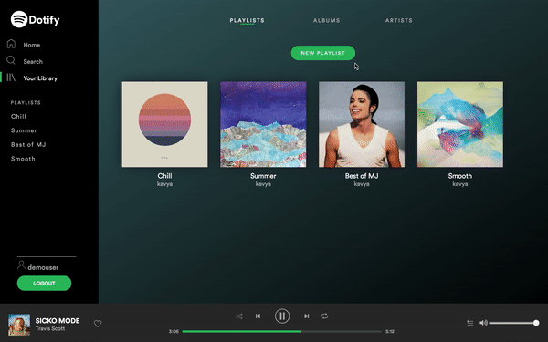
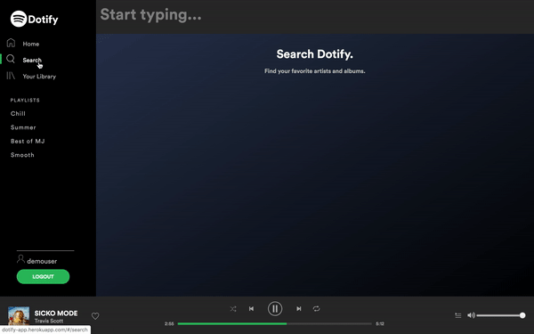
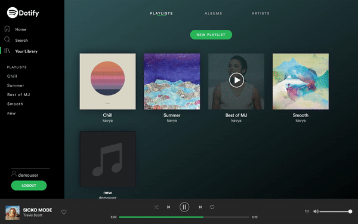

[Dotify live!](https://dotify-app.herokuapp.com/#/)
### Table of Contents
* [Introduction](https://github.com/kavya-kumar94/Dotify#introduction)
* [Technologies](https://github.com/kavya-kumar94/Dotify#technologies)
* [Code Snippets](https://github.com/kavya-kumar94/Dotify#code-snippets)
* [Features](https://github.com/kavya-kumar94/Dotify#features)
* [External Resources](https://github.com/kavya-kumar94/Dotify#external-resources)
* [Todo](https://github.com/kavya-kumar94/Dotify#todo)

### Introduction 
Dotify is a full-stack single-page web app based on the music streaming platform `Spotify`. Browse artists, albums, and playlists, as well as create your own playlists. This app utilizes React/Redux and is hosted on Heroku.

### Technologies
#### Frontend
* [React](https://reactjs.org/)
* [Redux](https://redux.js.org/)
* Webpack
* [Heroku](https://www.heroku.com/)
* SCSS 
* [React Router](https://reacttraining.com/react-router/)
* [React Audio Player](https://www.npmjs.com/package/react-audio-player)
#### Backend
* [Ruby on Rails](https://rubyonrails.org/)
* [PostgreSQL](https://www.postgresql.org/)
* [Amazon Web Services](https://aws.amazon.com/)
### Code Snippets
Implement tracker that moves as the duration of the song changes. Upon component mounting, the duration and positions are set. The progress is calculated and updated based on the offset of the two elements.
```js
componentDidMount() {
        let audio = document.querySelector('#audio');
        audio.addEventListener('ended', this.end); 
        audio.addEventListener('error', this.nextSong); 
        audio.addEventListener('timeupdate', this.updateProgress); 
        audio.addEventListener('click', this.setProgress); 


        if (audio) {
            setInterval(() => this.setState({
                duration: audio.duration,
                time: this.songTime(audio.currentTime),
                timePosition: (Math.floor(audio.currentTime / 60) === 0 ? "0" : `${Math.floor(audio.currentTime / 60)}`) + ":" + (Math.floor(audio.currentTime % 60) < 10 ? `0${Math.floor(audio.currentTime % 60)}` : `${Math.floor(audio.currentTime % 60)}`),
                timeDuration: (Math.floor(audio.duration % 60) < 10 ? `${Math.floor(audio.duration / 60)}:0${Math.floor(audio.duration % 60)}` : `${Math.floor(audio.duration / 60)}:${Math.floor(audio.duration % 60)}`),
                currentTime: (audio.currentTime/2.3),
            }), 1000)
            this.setState({ presentSong: this.props.presentSong });
        }
    }

setTime(position) {
        this.setState({ currentTime: position })
    }

setProgress(e) {
        let audio = document.querySelector('#audio');
        let target = e.target.nodeName === 'SPAN' ? e.target.parentNode : e.target;
        let width = target.clientWidth;
        let rect = target.getBoundingClientRect();
        let offsetX = e.clientX - rect.left;
        let duration = audio.duration;
        let currentTime = (duration * offsetX) / width;
        let progress = (currentTime * 100) / duration;

        audio.currentTime = currentTime;
        this.setState({ progress: progress });
        audio.play();
    }

    updateProgress() {
        let audio = document.querySelector('#audio');
        let duration = audio.duration;
        let currentTime = audio.currentTime;
        let progress = (currentTime * 100) / duration;

        this.setState({ progress: progress });
    }

    songTime(time) {
        let rounded = Math.floor(time);
        let minutes = Math.floor(rounded / 60);
        let seconds = Math.floor(rounded % 60);
        seconds >= 10 ? seconds = seconds : seconds = `0${seconds}`;
        return `${minutes}:${seconds}`;
    }
```

Use Fisher-Yates shuffle to implement shuffle button. Fisher-Yates is an algorithm for generating a random permutation of a finite sequence.

```js
random(array) {
        var currentIndex = array.length,
            temporaryValue,
            randomIndex;
        while (0 !== currentIndex) {
            randomIndex = Math.floor(Math.random() * currentIndex);
            currentIndex -= 1;
            temporaryValue = array[currentIndex];
            array[currentIndex] = array[randomIndex];
            array[randomIndex] = temporaryValue;
        }
        return array;
    }

    shuffle() {
        this.props.clearQueue();
        let shuffled = this.random(this.props.songs.slice());
        if (!this.state.shuffle) this.props.setQueue(shuffled);
        this.setState({ shuffle: !this.state.shuffle });
    }
```
### Features
#### Create and delete a Playlist
Playlists can be created on any of the index pages and can be edited and deleted
  <p align="center">
    
  </p>

#### Search
As you search the songs, Dotify renders the results with each enter keystroke. There is no need for a "search" button.
<p align="center">
  
</p>

#### Navigation with continuous playing music
As you navigate through different pages, the current song will continue to play. 
<p align="center">
  
</p>

#### Add and Remove songs from playlists
Songs can be added and removed from playlists.
<p align="center">
  
</p>

### External Resources
* [Amazon Web Services](https://aws.amazon.com/)
* [Heroku](https://www.heroku.com/)
* [Spotify Branding Guidelines](https://developer.spotify.com/branding-guidelines/)
* Font Circular
### Todo
* Add user and playlist follows
